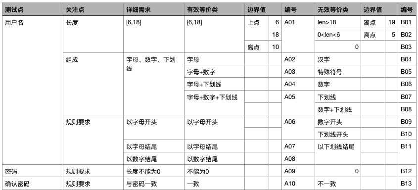
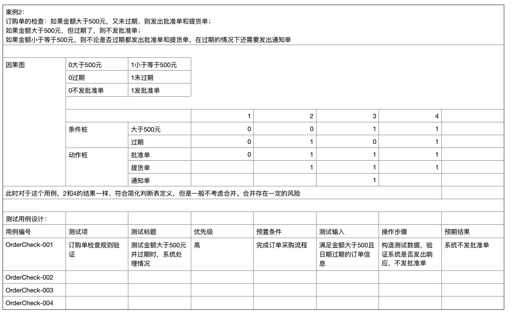

# 测试用例设计方法

## 测试用例格式十大特点

1. 用例编号
2. 测试项
3. 测试标题
4. 用例属性
5. 重要级别：高中低
6. 预置条件
7. 测试输入
8. 操作步骤
9. 预期结果
10. 实际结果

## 测试方法的选择

（1）首先进行等价类划分

（2）在任何情况下都必须使用边界值分析法

（3）可使用错误推测法追加测试用例

（4）对照程序逻辑，检查已设计的测试用例的逻辑覆盖程度，若没有达到要求的覆盖标准，应当再补充足够的测试用例

（5）若程序的功能说明中含有输入条件的组合情况，则一开始就可选因果图法和判定表驱动法

（6）对于参数配置类软件，需要使用正交试验法选择较少的组合方式达到最佳效果

（7）状态迁徙图法也是很好的测试用例设计方法，可根据不同时期条件的有效性设计不同的测试数据

（8）对于业务清晰的系统，可利用场景法贯穿整个业务流程，同时综合使用各种测试方法

## * 等价类划分法

1. 等价类定义（用于单个输入框）

<table border="1">
  <tr>
    <td rowspan="3">等价定义</td>
    <td>具有相同属性或者方法的事物集合</td>
  </tr>
  <tr>
    <td>这个集合中某个体所表现的特征与其他个体完全一致</td>
  </tr>
  <tr>
    <td>对于某个被测对象的测试输入而言，某个个体能够被接受或被拒绝，则该个体在集合中的任意个体都应被接受或被拒绝</td>
  </tr>
</table>

2. 等价类划分

<table border="1">
  <tr>
    <td rowspan="3">等价类划分</td>
    <td>有效等价类</td>
    <td>针对被测对象而言，合理的、有意义的、系统接受的输入</td>
    <td>如：用户名长度在[6,18]</td>
  </tr>
  <tr>
    <td>无效等价类</td>
    <td>针对被测对象而言，不合理的、无意义的、系统不能接受的输入</td>
    <td>如：用户名长度大于18位，或者小于6位</td>
  </tr>
</table>

3. 等价类划分规则

<table border="1">
  <tr>
    <td rowspan="7">等价类划分规则</td>
    <td rowspan="2">如果需求规定了输入域的取值个数或确定了某个范围时，则可确定一个有效等价类及两个无效等价类</td>
    <td>有效等价类</td>
    <td>如：用户名长度在[6,18]</td>
  </tr>
  <tr>
    <td>无效等价类</td>
    <td>如：用户名长度大于18位，或者小于6位</td>
  </tr>
  <tr>
    <td rowspan="2">如果需求规定了某个输入域的集合，或者“必须如何”的情况下，可确定一个有效等价类及一个无效等价类</td>
    <td>有效等价类</td>
    <td>如：以字母开头</td>
  </tr>
  <tr>
    <td>无效等价类</td>
    <td>如：非字母开头</td>
  </tr>
  <tr>
    <td colspan="3">如果需求规定了某个输入域是真假值，可确定一个有效等价类和一个无效等价类</td>
  </tr>
  <tr>
    <td>如果需求规定了某个输入域是是一组值，则可确定若干个有效等价类及一个无效等价类</td>
    <td>XX商场</td>
    <td>钻石会员、金牌会员、铜牌会员和普通注册会员</td>
  </tr>
  <tr>
    <td>如果需求规定必须准守某种规则时，可确定一个有效等价类及若干个从不同角度违反规则的无效等价类</td>
    <td>以字母开头</td>
    <td>有效等价类：以字母开头；无效等价类：以数字、汉字、特殊字符开头</td>
  </tr>
</table>

4. 进行等价类用例设计

<table border="1">
  <tr>
    <td rowspan="3">进行用例设计</td>
    <td>根据需求，划分有效及无效等价类，有效等价类统一编码，无效等价类统一编码</td>
  </tr>
  <tr>
    <td>设计一个新的测试用例，使其尽可能的覆盖所有尚未覆盖的有效等价类，直到所有有效等价类都被覆盖</td>
  </tr>
  <tr>
    <td>设计一个新的测试用户，使其仅覆盖一个无效等价类，直到所有无效等价类都被覆盖</td>
  </tr>
</table>

5. 案例加以说明

:::tip 用户创建账号
用户名：[6~18个字符，包括字母、数字、下划线][字母开头，字母和数字结尾，不区分大小写]

密码：

确认密码：
:::

## * 边界值分析法

针对功能说明中的输入输出域，进行边界值和极限值的设计和测试。如果测试对象是时间，应该重点考虑跨年、跨月、2月等。

1. 边界值的三点（用于单个输入框）

例：用户名长度为6~18位

<table border="1">
  <tr>
    <td rowspan="3">边界值三点</td>
    <td>上点</td>
    <td>边界上的点</td>
    <td>6</td>
    <td>8</td>
  </tr>
  <tr>
    <td rowspan="2">离点</td>
    <td>离上边最近的点</td>
    <td>5</td>
    <td>19</td>
  </tr>
  <tr>
    <td>根据上点的精度确定</td>
    <td></td>
    <td></td>
  </tr>
  <tr>
    <td>内点</td>
    <td>边界有效范围内的任意一点</td>
    <td>10</td>
    <td></td>
    <td></td>
  </tr>
  <tr>
    <td rowspan="2">如何确定离点</td>
    <td>如果边界是闭区间，则离点在外</td>
    <td>[6,18]</td>
    <td>上点：6，18  离点：5，19  内点：10</td>
    <td></td>
  </tr>
   <tr>
    <td>如果边界是开区间，则离点在内</td>
    <td>（6,18）</td>
    <td>上点：6，18  离点：7，17  内点：10</td>
    <td></td>
  </tr>
</table>

2. 边界值应用场景

<table border="1">
  <tr>
    <td rowspan="4">边界值应用场景</td>
    <td>如果需求规定了取值范围或规定了取值个数时，可利用该范围的边界内及边界附近的数据进行测试</td>
    <td>[6,18]</td>
    <td>6,18,5,19,10</td>
  </tr>
  <tr>
    <td>如果需求规定了取值的个数，则少于个数一个或多于个数一个的值进行测试</td>
    <td>购买5件商品则打8折</td>
    <td>4或5或6件商品</td>
  </tr>
  <tr>
    <td>如果需求规定了一个有序集合的时候，可使用该集合的第一个和最后一个值进行测试</td>
    <td>下拉列表有4个城市名可供选择</td>
    <td>第一个和最后一个城市</td>
  </tr>
  <tr>
    <td>如果程序中使用一个内部数据结构的话，则应从该数据结构的边界进行考虑</td>
    <td>int型</td>
    <td>在int长度范围内</td>
  </tr>
</table>

3. 边界值方法应用步骤

<table border="1">
  <tr>
    <td rowspan="3">边界值方法应用步骤</td>
    <td>根据等价类方法划分有效等价类和无效等价类，确定上点、离点及内点，每个点统一编号</td>
  </tr>
  <tr>
    <td>设计一个新的用例，使其尽可能的覆盖所有尚未覆盖的有效等价类，直到所有有效等价类完全覆盖</td>
  </tr>
  <tr>
    <td>设计一个新的测试用例，使其仅覆盖一个无效等价类，直到所有无效等价类完全覆盖</td>
  </tr>
</table>

## 正交试验

1. 因子和水平的定义

因子：所有参与实验的影响试验结果的条件称为因子

水平：影响试验因子的取值或输入称为水平

2. 特点

整齐可比：在同一张正交表中，每个因子每个水平出现的次数完全相同，试验中，每个因子的每个水平与其他因子的水平参与试验的几率完全相同

均匀分撒：同一张正交表中，任意两列的水平搭配是完全相同的

__针对输入框2个及以上(可以使用正交设计小助手)__

3. 设计流程

    * 分析测试需求获取因子及水平

    * 根据因子水平选择合适的正交表

    * 替换因子水平，获取试验次数

    * 细化输出获得测试用例

4. 注意点

    * 选择正交表时，因子与水平恰好与正交表相同

    * 被测对象因子与正交表中的因子数不同时，选择正交表中因子稍大于被测对象因子数，且试验次数最少的、多余的因子弃用

    * 被测对象水平与正交表中的水平不同时，可根据实际情况进行合并，然后拆分

    * 因子、水平都不相同时，则可选择因子、水平稍大于被测对象的，且试验次数最少的

5. 案例加以说明

## * 因果图法

以需求设计说明书为依据设计业务测试流程图和测试案例。__因果判定法一般主要应用于页面中各类按钮之间存在组合和制约的关系，测试人员需要去分析它们的因果对应关系，并最终去检查输出结果的正确性。__

1. 因果图的基本符号

（1）恒等：若a=1，则b=1；若a=0，则b=0

（2）非：若a=1，则b=0，若a=0，则b=1

（3）或：若a=1或b=1或c=1，则d=1；若a= b= c=0，则d=0

（4）与：若a= b= c=1，则d=1；若a=0且b=0且c=0，则d=0

2. 因果图的约束条件

因果图中某些原因与原因之间、原因与结果之间的组合情况由于语法或环境限制不可能同时出现。为表明这些特殊情况，在因果图上用一些记号代表约束或限制条件。

（1）互斥：表示不能同时为1，即a、b、c中至多有一个为1

（2）包含：表示不能同时为0，即a、b、c中至少有一个为1

（3）唯一：表示a、b、c中有且仅有一个为1

（4）要求：表示若a=1，则b必须为1，即不可能a=1且b=0

（5）屏蔽：表示若a=1，则b必须为0。

3. 因果图法的特点

（1）考虑输入条件的组合关系

（2）考虑输出条件对输入条件的信赖关系，即因果关系

（3）测试用例发现错误的效率高

（4）可检查出功能说明书中的某些不一致或遗漏

（5）适合于检查程序输入条件和各种组合情况

4. 因果图的基本步骤

    4.1 分割功能说明书

    对于规模较大的程序，可将其划分为若干个部分，然后分别对每个部分使用因果图法。例如，测试编译程序时，可将每个语句作为一个部分

    4.2 判断出“原因”和“结果”，并加以编号

    原因指输入条件或的等价类，结果指输出条件的等价类。每个原因或结果都对应因果图中的一个节点。当原因或结果成立（或出现）时，相应的节点取值为1，否则为0

    例 有一个饮料自动售货机（单价为5角钱）的控制处理软件，它的功能说明书如下：若投入5角钱的硬币，按下“可乐”或“绿茶”按钮，则送出相应的饮料。若投入1元钱的硬币，同样也是按下“可乐”或“绿茶”按钮，则在送出相应饮料的同时退回5角钱的硬币。
    
    通过分析上述功能说明书，可列出原因和结果如下：
    
    原因：投入1元硬币；投入5角硬币；按下“可乐”按钮；按下“绿茶”按钮。
    
    结果：退还5角钱；送出“可乐”饮料；送出“绿茶”饮料。

    4.3 根据功能说明书中原因和结果之间的关系画出因果图

    

    4.4 根据因果图绘制判定表

    绘制判定表的方法较为简单，将所有原因作为输入条件，每一项原因（输入条件）安排为一行，所有输入条件直接列出（真值为1，假值为0），将每种条件组合安排为一列，并将各个条件的取值情况分别添加到判定表的对应单元格中。
    
    例如，若因果图中的原因有4项，则判定表中的输入条件共有4行，而列为2^4=16列。输入条件的取值确定完成之后，可根据判定表轻松地推算出各种结果的组合，即输出。判定表也包含中间节点的状态取值。上述描述考虑了所有条件的组合情况，如果输入条件较多，条件组合的数量会较为庞大，从而导致绘制出的判定表列数过多，过于复杂。而在实际情况下，条件与条件之间可能会存在约束，许多条件的组合是无效的，因此根据因果图绘制判定表时，可有意识地排除无效的条件组合，从而大幅减少判定表的列数。

    

    4.5 为判定表的每一列设计一个测试用例

## * 判定表

1. 定义

分析和表述若干输入条件下，被测对象针对这些输入做出的响应的一种工具，在遇到复杂业务逻辑时，可以利用该表，理清业务逻辑关系

2. 判定表的组成

条件桩：列出所有可能的条件（问题），列出的条件（问题）一般与次序无关

动作桩：列出条件（问题）规定可能采取的操作，对这些操作的排列顺序没有约束

条件项：列出针对它所列条件的取值，即在所有可能情况下的真假值

动作项：列出在条件项的各组取值情况下应该采取的动作

任何一个条件组合的特定取值及相应要执行的动作称为一条规则

在判定表中贯穿条件项和动作项的一列就是一条规则，即判定表中的条件取值组数与规则的调试以及条件项和动作项的列数相等

3. 判定表应用步骤

* 理解需求，确定条件桩、动作桩

* 确定规则个数。例如，有n个条件，每个条件都有两个取值（0,1），故有2^n种规则

* 填写条件项

* 填写动作项，绘制初始判定表

* 简化，合并相似规则或者相同动作

* 抽取测试用例

4. 案例加以说明判断表

## 状态迁移图法

1. 定义

关注被测对象的状态变化，在需求规格说明书中是否有不可达到的状态和非法的状态，是否产生非法的状态转移

2. 状态

被测对象在特定输入条件下所保持的相应形式

3. 方法流程

    1. 根据需求明确状态节点

    2. 绘制状态迁移图

    3. 绘制状态迁移树

    4. 抽取测试用例

4. 案例加以说明

## 流程分析法（场景设计法）

事件触发时的情景就形成了场景，同一事件采用不同的触发顺序和处理结果就形成了事件流。

1. 设计三个场景

基本流：通过业务流程输入都为正确的，能够最后达到目标的流程（ATM取款：插入银行卡，输入密码，输入取款金额，取款，取卡）

备选流：通过实现业务流程时，因错误操作或异常输入，导致流程存在反复，但最终能够完成期望业务的流程（ATM取款：插入银行卡，输入密码（第一次输入错误，重新输入后，完成剩余操作））

异常流：通过实现业务流程时，因错误操作或异常输入，导致业务没有正确完成（ATM取款：插入银行卡，输入密码，错误3次，吞卡）

2. 设计步骤

    1. 理解需求，确定业务流程（基本流、备选流、异常流）

    2. 根据基本流和各备选流生成不同的场景

    3. 根据业务流程图，抽取测试路径，每次路径需包含一个从未走过的路径

    4. 重新审核设计的测试用例，去掉多余的测试用例。确定测试用例后，针对最终确定的测试用例设计测试数据

3. 注意点

需使用等价类、边界值、正交试验、判定表、因果图等方法保证单个功能的正确性

缺点：本身不校验单个功能节点的正确性，只关心流程能不能走通。

4. 案例加以说明

## 错误推测法

采用逆向思维方式，结合以往测试经验和直觉设计软件在功能和流程上可能存在的各种错误，进行容错性测试。

## 业务流程测试方法

业务流程测试主要是在功能点测试的基础上，测试系统完成某项业务的能力。业务流程重点考查系统不同模块、不同子系统之间的功能衔接、数据流向以及完成业务功能的正确性和便利性。按照以下原则进行流程测试：

1. 先测功能后测流程：业务流程测试是建立在功能点测试基础上的。首先要保证流程测试涉及到的功能点实现正确，所以，流程测试安排在功能测试的后面进行。

2. 先测主流程后测分支流程：主流程就是指按照正常情况实现的业务流程，分支流程指出现特殊情况后的业务流程。

3. 先测子系统内的流程，后测子系统间的流程：子系统内的流程测试随子系统的功能测试进行。