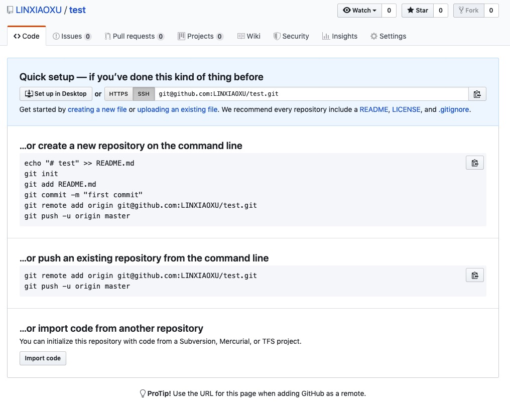

# git 相关知识

## git 本地新建项目提交到远程仓库

1. 在git服务器上创建一个仓库，这里使用GitHub创建一个仓库



2. 按照步骤2中的命令执行

```bash
echo "# test" >> README.md # echo表示输出# test到README.md中
git init # 表示初始化本地已有项目
git add README.md # 将README.md添加到缓存区
git commit -m "first commit" # 将缓存区的内容提交到本地仓库
git remote add origin git@github.com:LINXIAOXU/test.git # 提交到远程分支缓存区
git push -u origin master # 提交本地分支到远程分支，第二次提交只需要执行“git push”命令
```

## git 克隆项目

前提：在github上配置了本机的SSH keys

```bash
git clone [repository] # 使用SSH keys 来克隆，如 git clone git@github.com:LINXIAOXU/qa-docs.git
```

## git 分支相关操作

1. 新建分支

分支是为了将修改记录的整体流程分叉保存。分叉后的分支不受其他分支的影响，所以在同一个版本库里可以同时进行多个修改。每个新建的库都自带master分支。

```bash
git branch [分支名] # 如 git branch lml-git ,表示在本地新建一个名为lml-git的分支
```

2. 切换分支

```bash
git checkout [分支名] # 如 git checkout lml-git ,表示从‘master’分支切换到‘lml-git’分支
```

3. 查看本地分支

```bash
git branch # 分支显示出来后，可以输入冒号加上q退出界面
```

4. 删除本地分支

```bash
git branch -D [分支名] # 如 git branch -D lml-git ,表示删除了本地分支lml-git,注意：删除本地分支必须切换到master删除
```

## 提交代码

1. 将当前工作目录文件添加到索引(即将修改添加到缓存区，为提交到本地git服务器做准备)。

```bash
git add . # 也可以指定文件名执行该命令，如 git add README.md 代表想要将README.md这个文件添加到缓存区，等待提交
```

2. 把对文件的改动提交到本地git服务器。

```bash
git commit -m "message" # -m 参数表示可以直接输入后面的message，message可以简略写这次改动文件的原因或者内容，将缓存区的内容提交到本地仓库
```

3. 把本地git服务器的版本库里新分支的内容全部传送给远程版本库，让远程版本库和本地git服务器的版本库内容一致。

```bash
git push --set-upstream origin <本地新建分支名>  # 因为这里是第一次push本地新分支，所以需指明本地新分支名，下一次再push这个分支，就只需要执行“git push”命令了，将缓存区的内容提交到远程仓库
```

## 合并代码

前提：在本地分支修改代码的同时，master分支发生了改动，需要在本地分支合并master分支改动的代码

```bash
git merge origin/master  # 此命令代表把master分支合并到当前分支
```

## 同步远程仓库改动

```bash
git pull  # pull可以理解为把远程版本库的内容拉过来至本地
```

## 删除远程分支

```bash
git push -d origin [分支名] # 如 git push -d origin lml-git ,表示删除远程仓库的lml-git分支
```

## 查看提交状态

```bash
git status # 可以用来查看仓库的状态，nothing to commit, working tree clean  表示没有未提交的文件
```

## 撤回修改的文件

```bash
git status # 查看修改的文件
git checkout . # 撤回修改的文件
```

## 查看本机的git 用户名和邮箱

```bash
git config user.name # 查看用户名

git config user.email # 查看邮箱
```

## 全局修改本机的git 用户名和邮箱

```bash
git config --global user.name [用户名] # 如 git config --global user.name LML ,表示修改用户名为LML

git config --global user.email [邮箱] # 如 git config --global user.name 100*****08@qq.com ,表示修改邮箱为100*****08@qq.com
```

## 局部修改本机的git 用户名和邮箱

```bash
git config user.name [用户名] # 如 git config user.name LML ,表示修改用户名为LML

git config user.email [邮箱] # 如 git config user.name 100*****08@qq.com ,表示修改邮箱为100*****08@qq.com
```

## git提交代码 忽略上传node_modules文件夹

1. 在项目的根目录底下，新建.gitignore
2. 打开.gitignore，添加node_modules
3. 如果在远程仓库中，已经上传了node_modules，则执行git rm -r -f --cached **/node_modules/ 删除远程仓库的node_modules，然后提交代码即可